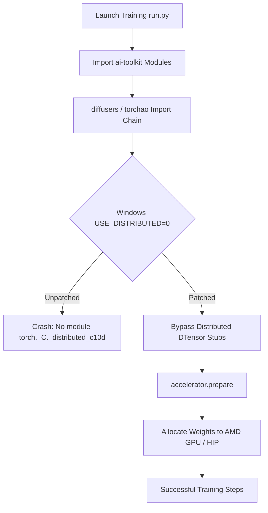

# Standalone AMD ROCm Setup & Technical Patch Guide for AI-Toolkit

> **Reference Only / As-Is**: This script and guide document an experimental local setup for running ai-toolkit natively on AMD hardware via Windows ROCm. It is provided strictly as reference material without support, troubleshooting, or updates.

## Overview

[AI-Toolkit](https://github.com/ostris/ai-toolkit) by ostris is one of the premier, highly extensible LoRA training frameworks in the generative AI ecosystem, supporting state-of-the-art architectures including **Chroma**, **Flux**, **SDXL**, and **SD 1.5**.

Historically, training LoRAs with AI-Toolkit on **Windows with AMD Radeon GPUs** was considered near-impossible due to a web of platform incompatibilities:
1. AMD ROCm PyTorch wheels for Windows are distributed through AMD repositories (`repo.radeon.com`) rather than standard PyPI.
2. Windows ROCm PyTorch binaries are compiled without the distributed C++ extension (`USE_DISTRIBUTED=0`), lacking `torch._C._distributed_c10d`.
3. Upstream libraries (`torchao`, `diffusers`, and `accelerate`) unconditionally import distributed tensors (`DTensor`), causing fatal crashes on Windows.
4. The Windows port of `rocm_sdk` attempts to query Linux `.so` shared objects during module initialization.

This document outlines the **architectural mechanics of the runtime patches developed in this project** and how to deploy a 100% standalone, fully functional AMD ROCm AI-Toolkit training environment using the companion automation script [`Setup-AmdAiToolkit.ps1`](../Utilities/Setup-AmdAiToolkit.ps1).

> [!NOTE]
> **Project Context & Disclaimer**:
> - **Proof of Concept**: This setup script and patch collection represent an early **proof of concept** created to overcome current Windows AMD ROCm hurdles. While this setup has been tested and verified on our local hardware (Radeon RX 9070 XT), AMD hardware configurations, Windows driver versions, and environments can differ significantly—what works seamlessly in our test environment may require adjustments or further testing on yours. Community feedback and real-world testing are warmly welcomed!
> - **Performance Expectation (AMD vs. NVIDIA)**: Native Windows AMD ROCm training may currently be slower than native NVIDIA CUDA training due to early Windows ROCm driver maturity and attention kernel optimizations. However, it is **fully working natively on Windows** without requiring dual-boot Linux configurations, heavy WSL2 virtual machines, or restrictive DirectML fallbacks.
> - **AI-Assisted Development**: These scripts, patches, and documentation were created with AI assistance. In the spirit of complete transparency: if you prefer not to use AI-assisted code, please feel free to pass on this script and wait for official upstream Windows ROCm fixes from the respective project maintainers.
> - **LoRAMancer Context**: These fixes originated as part of **LoRAMancer** (an upcoming desktop LoRA manager and training orchestrator, currently **unreleased / in private development**). It is not yet released publicly because we are currently in deep hardware validation, thorough testing, critical bug fixing, and UI polish stages. Once ready, LoRAMancer will be 100% open source and we will warmly welcome community contributions! We are sharing this standalone setup script early to give fellow AMD creators a working solution without having to wait for the complete desktop suite.

---

## Why a Standalone Utility?

While **LoRAMancer** (currently unreleased) provides a full graphical desktop UI, SQLite library management, and hyperparameter cloning wizard, many engineers and creators in the open-source community prefer working directly from terminal environments, automated batch scripts, or their own bespoke pipelines.

Releasing this setup script and technical document empowers AMD users worldwide to train LoRAs on Windows immediately, without waiting for upstream PR merges across multiple independent repositories (`torchao`, `diffusers`, `accelerate`, and `ai-toolkit`).

---

## Hardware & Environment Matrix

| GPU Model | Architecture | HSA_OVERRIDE_GFX_VERSION | PyTorch Backend | Status |
| :--- | :--- | :--- | :--- | :--- |
| **Radeon RX 9070 XT / 9070** | RDNA 4 (Navi 48) | `11.0.0` | ROCm 7.2.1 | **Verified / Primary Test System** |
| **Radeon RX 7900 XTX / XT / GRE** | RDNA 3 (Navi 31) | `11.0.0` | ROCm 7.2.1 | Verified / Production |
| **Radeon RX 7800 XT / 7700 XT** | RDNA 3 (Navi 32) | `11.0.1` | ROCm 7.2.1 | Supported |
| **Radeon RX 7600 XT / 7600** | RDNA 3 (Navi 33) | `11.0.2` | ROCm 7.2.1 | Supported |
| **Radeon RX 6950 XT / 6900 XT / 6800** | RDNA 2 (Navi 21) | `10.3.0` | ROCm 7.2.1 | Supported |
| **Radeon RX 6700 XT / 6750 XT** | RDNA 2 (Navi 22) | `10.3.0` | ROCm 7.2.1 | Supported |

### Prerequisites

> [!IMPORTANT]
> **AMD ROCm & HIP SDK Installation Required**:
> You **must** have **AMD ROCm 7.2 (or compatible 7.x) and the HIP SDK for Windows** installed on your system before proceeding. The Python environment and PyTorch wheels communicate directly with the underlying HIP runtime DLLs (such as `amdhip64.dll`) deployed to `C:\Program Files\AMD\ROCm\`.
> 
> Download the **AMD ROCm™ Software / HIP SDK for Windows (v7.2)** from the official AMD Developer portal:
> - [AMD ROCm Software for Windows](https://www.amd.com/en/developer/resources/rocm-hub/hip-sdk.html)

- **OS**: Windows 10 (21H2+) or Windows 11 (x64)
- **AMD Compute Stack**: **AMD ROCm 7.2 & HIP SDK for Windows** installed (default path: `C:\Program Files\AMD\ROCm\7.2\` or `C:\Program Files\AMD\ROCm\`)
- **GPU Driver**: AMD Software: Adrenalin Edition 24.x+ with ROCm compute support
- **Python**: Python 3.12 (64-bit) from [python.org](https://www.python.org/downloads/)
- **Git**: Git for Windows from [git-scm.com](https://git-scm.com/)

---

## Anatomy of the Applied Patches

The script [`Utilities/Setup-AmdAiToolkit.ps1`](../Utilities/Setup-AmdAiToolkit.ps1) applies surgical, in-place patches to `.venv` packages to resolve the Windows ROCm blockers.



### 1. Missing Library Stubs in `rocm_sdk` (`_dist_info.py`)

When initializing ROCm on Windows:
```python
import torch # calls _rocm_init.initialize() -> import rocm_sdk -> from ._dist_info import __version__
```
The Windows port queries Unix shared libraries that do not exist on Windows, raising `ModuleNotFoundError: No module named 'libhipsparselt'` or indentation syntax errors.

**The Patch:**
Appends 4-argument library entry stubs without leading indentation to `.venv/Lib/site-packages/rocm_sdk/_dist_info.py`:
```python
# [loramancer] windows-missing-libs
LibraryEntry("hipsparselt", "core", "libhipsparselt.so.0", "")
LibraryEntry("hipdnn", "core", "libhipdnn.so.0", "")
LibraryEntry("rocm-openblas", "core", "librocm-openblas.so.0", "")
```

---

### 2. Missing `torch._C._distributed_c10d` (`torchao` & `diffusers`)

- `ai-toolkit` requires `torchao` for `_DTYPE_TO_BIT_WIDTH` in `toolkit/config_modules.py`.
- `diffusers` inspects `torchao` on startup via `is_torchao_available()`.
- Windows ROCm PyTorch builds are compiled with `USE_DISTRIBUTED=0`, omitting `torch._C._distributed_c10d.pyd`.
- When `torchao` imports its float8 quantization submodules, it tries to load `from torch.distributed._tensor import DTensor`, which fails fatally with:
  ```text
  ModuleNotFoundError: No module named 'torch._C._distributed_c10d'; 'torch._C' is not a package
  ```

**The Patches:**
Because single-GPU local LoRA training does not use multi-node distributed tensor parallelism, we apply targeted mock guards:
1. **`torchao/__init__.py`**:
   ```python
   # [loramancer] windows-c10d-guard
   try:
       from torchao.quantization import (
           autoquant,
           quantize_,
       )
       from . import dtypes, optim, testing
   except Exception as e:
       import logging
       logging.debug(f"Skipping distributed/c10d dependent modules: {e}")
   ```
2. **`torchao/float8/distributed_utils.py`**:
   Wraps `funcol` and `DTensor` imports in `try...except: funcol = None; DTensor = None`.
3. **`torchao/float8/float8_tensor.py`**:
   Wraps `DTensor` in `try...except: class DTensor: pass`.
4. **`torchao/float8/float8_utils.py`**:
   Wraps `dist`, `AsyncCollectiveTensor`, and `all_reduce` in `try...except: dist = None; AsyncCollectiveTensor = None; all_reduce = None`.

---

### 3. Missing `torch.distributed` Stubs (`group`, `ReduceOp`)

`ai-toolkit` extension loaders scan `extensions_built_in/diffusion_models/hidream/moe.py`, which executes `from torch.distributed import group, ReduceOp`.

In PyTorch's default `torch/distributed/__init__.py` on Windows, only `_ProcessGroupStub` is defined. The symbols `group`, `ReduceOp`, and helper functions are missing entirely.

**The Patch:**
Appends full stubs directly to `torch/distributed/__init__.py`:
```python
    # [loramancer] windows-distributed-stubs
    class _GroupStub:
        WORLD = None

    class _ReduceOpStub:
        SUM = None
        PRODUCT = None
        MIN = None
        MAX = None
        BAND = None
        BOR = None
        BXOR = None

    sys.modules["torch.distributed"].group = _GroupStub
    sys.modules["torch.distributed"].ReduceOp = _ReduceOpStub
    sys.modules["torch.distributed"].is_initialized = lambda: False
    sys.modules["torch.distributed"].get_rank = lambda group=None: 0
    sys.modules["torch.distributed"].get_world_size = lambda group=None: 1
```

---

### 4. Accelerate `model_has_dtensor` Inspection Guard

During `accelerator.prepare_model(self.sd.vae)` in `ai-toolkit`, `accelerate.utils.other.model_has_dtensor(model)` unconditionally attempts `from torch.distributed.tensor import DTensor`.

In PyTorch 2.x, importing `torch.distributed.tensor` cascades into `_functional_collectives` &rarr; `distributed_c10d`, triggering the missing C++ module error.

**The Patch:**
1. In `torch/distributed/tensor/__init__.py`:
   Wraps the file body in a `try...except: class DTensor: pass` fallback.
2. In `accelerate/utils/other.py`:
   ```python
   # [loramancer] windows-dtensor-guard
   def model_has_dtensor(model):
       try:
           from torch.distributed.tensor import DTensor
           return any(isinstance(param, DTensor) for param in model.parameters())
       except Exception:
           return False
   ```

---

### 5. Chroma Architecture: Negative Prompt Tokenizer Guard

In `extensions_built_in/diffusion_models/chroma/chroma_model.py`, if a training configuration omits `neg:` or passes `neg_prompt = None`, `get_prompt_embeds()` previously passed `prompt = None` directly into the HuggingFace tokenizer, throwing:
```text
ValueError: text input must be of type `str` (single example), `list[str]` (batch or single pretokenized example)...
```

**The Patch:**
```python
# [loramancer] chroma-prompt-guard
if prompt is None:
    prompt = ""
elif isinstance(prompt, list):
    prompt = [p if p is not None else "" for p in prompt]
text_inputs = self.tokenizer[1](prompt)
```

---

## Quickstart: Installing with the Standalone Script

Run PowerShell as a standard user (administrator is not required):

```powershell
# Run the automated installer (from the folder containing the script):
pwsh -File .\Setup-AmdAiToolkit.ps1 -TargetDir "C:\AI\ai-toolkit"

# Or from the repository root:
# pwsh -File .\Utilities\Setup-AmdAiToolkit.ps1 -TargetDir "C:\AI\ai-toolkit"
```

The script will:
1. Auto-detect your AMD GPU and configure the matching `HSA_OVERRIDE_GFX_VERSION`.
2. Find system Python 3.12 and create a clean `.venv`.
3. Install AMD ROCm 7.2.1 PyTorch (`torch`, `torchvision`, `torchaudio`) and ROCm SDK wheels.
4. Clone `ostris/ai-toolkit` with all submodules.
5. Install `requirements.txt` while protecting PyTorch binaries.
6. Apply all runtime patches listed above.
7. Generate `run-amd.ps1` in the destination directory.
8. Perform a self-test verifying that ROCm, TorchAO, and Diffusers load without errors.

---

## Running LoRA Training

Use the generated `run-amd.ps1` wrapper, which sets essential environment variables before invoking Python:

```powershell
cd "<path_to_your_ai_toolkit_folder>" # e.g. cd "C:\AI\ai-toolkit"
.\run-amd.ps1 "path\to\your_config.yaml"
```

### Essential Hardware Environment Flags

The launcher automatically sets:
```powershell
$env:HSA_OVERRIDE_GFX_VERSION = "11.0.0" # or your specific GPU target
$env:PYTORCH_ROCM_ARCH        = "native"
$env:MIOPEN_FIND_MODE         = "FAST"
$env:PYTHONUNBUFFERED         = "1"
$env:PYTHONIOENCODING         = "utf-8"
```

### Recommended Training Configuration for AMD

In your `config.yaml`, ensure:
- **Optimizer**: Use `adamw` (or `prodigy`), decoupled from precision:
  ```yaml
  train:
    optimizer: "adamw"
    dtype: "bf16" # or fp16
  ```
- **Attention**: Default to PyTorch's native Scaled Dot-Product Attention (`sdpa`):
  ```yaml
  model:
    attn_type: "sdpa"
  ```

---

## Verification & Self-Test

You can verify that your patched environment is healthy at any time directly from your target installation directory:

```powershell
# 1. Navigate into your ai-toolkit installation folder (where .venv is located):
cd "<path_to_your_ai_toolkit_folder>"

# 2. Run the self-test using the local virtual environment:
.\.venv\Scripts\python.exe -c @"
import torch
print('ROCm Active:', torch.cuda.is_available())
if torch.cuda.is_available():
    print('GPU Device :', torch.cuda.get_device_name(0))
from torchao.quantization.quant_primitives import _DTYPE_TO_BIT_WIDTH
from diffusers import AutoencoderTiny
print('Status     : All Windows AMD ROCm patches validated successfully!')
"@
```

Alternatively, you can invoke the test from any PowerShell terminal by referencing your install path:

```powershell
$InstallPath = "<path_to_your_ai_toolkit_folder>" # e.g. "C:\AI\ai-toolkit" or ".\ai-toolkit"
& (Join-Path $InstallPath ".venv\Scripts\python.exe") -c @"
import torch
print('ROCm Active:', torch.cuda.is_available())
if torch.cuda.is_available():
    print('GPU Device :', torch.cuda.get_device_name(0))
from torchao.quantization.quant_primitives import _DTYPE_TO_BIT_WIDTH
from diffusers import AutoencoderTiny
print('Status     : All Windows AMD ROCm patches validated successfully!')
"@
```
